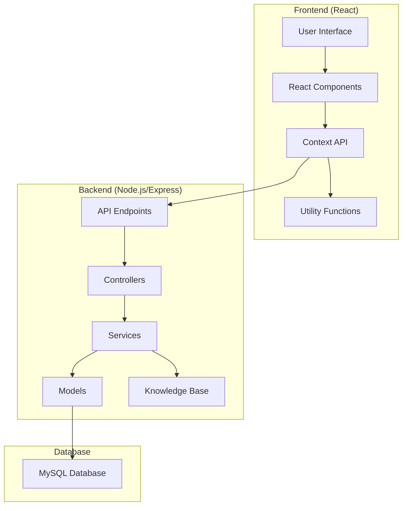
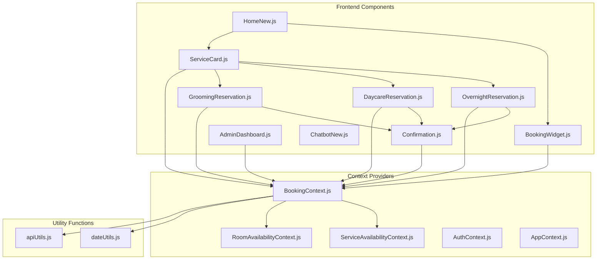
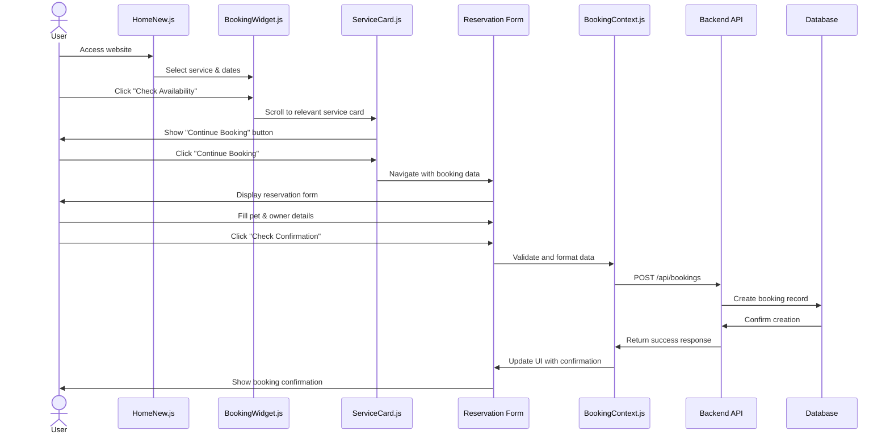
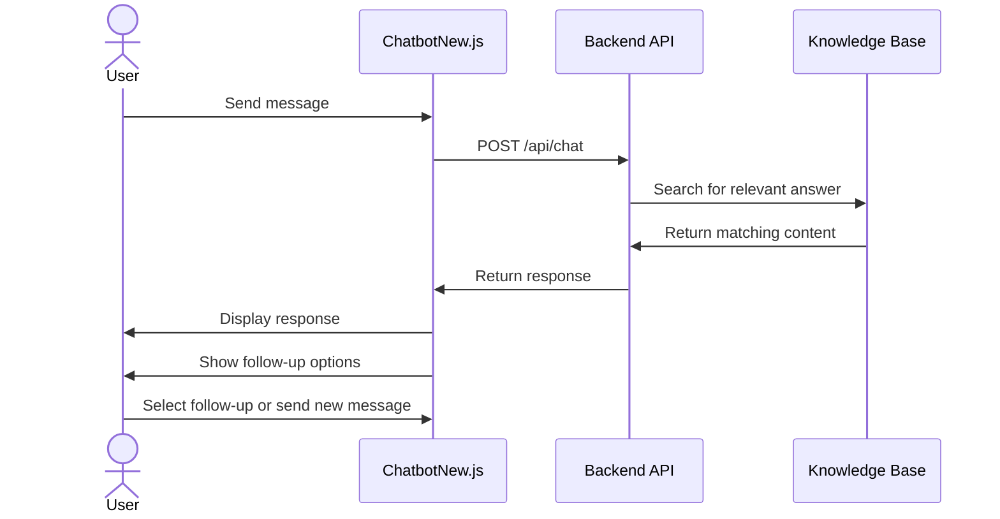
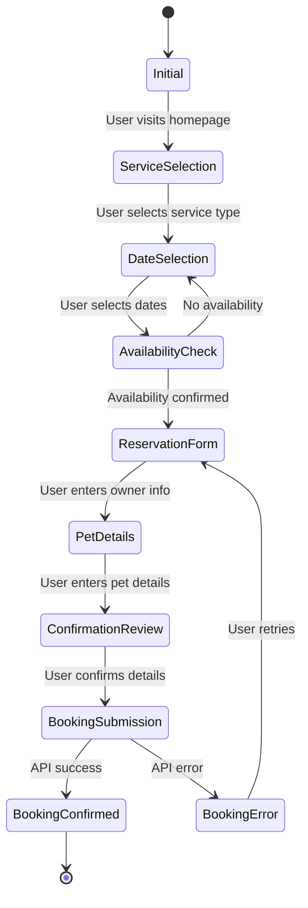
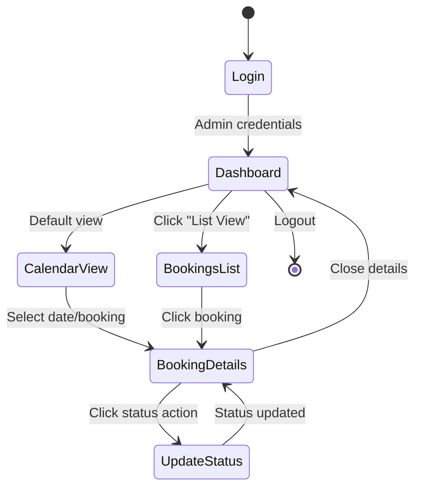

# Baguio Pet Boarding System - UML Diagrams

## Table of Contents
1. [System Architecture Diagram](#system-architecture-diagram)
2. [Component Diagram](#component-diagram)
3. [Class Diagram](#class-diagram)
4. [Sequence Diagrams](#sequence-diagrams)
5. [State Diagrams](#state-diagrams)

## System Architecture Diagram



## Component Diagram



## Class Diagram

```mermaid
classDiagram
    class BookingContext {
        -bookings: Array
        -userBookings: Array
        -unavailableDates: Array
        -isLoading: boolean
        -error: string
        -currentUser: Object
        -userRole: string
        -MAX_SLOTS: Object
        +initializeUser(userData, role)
        +fetchBookings(userId)
        +addBooking(bookingData)
        +updateBookingStatus(bookingId, newStatus)
        +addUnavailableDate(date)
        +removeUnavailableDate(date)
        +fetchUnavailableDates()
        +countBookingsByServiceAndRoom(date, serviceType, roomType)
        +isServiceAtCapacity(date, serviceType, roomType)
        +getAvailableSlots(date, serviceType, specificService)
    }
    
    class ServiceAvailabilityContext {
        -serviceAvailability: Object
        +getServiceAvailability(serviceType, groomingType)
        +updateServiceAvailability(serviceType, groomingType, change)
    }
    
    class RoomAvailabilityContext {
        -roomAvailability: Object
        +getRoomAvailability(roomType, date)
        +updateRoomAvailability(roomType, date, change)
    }
    
    class AuthContext {
        -user: Object
        -isAuthenticated: boolean
        -role: string
        +login(credentials)
        +logout()
        +register(userData)
    }
    
    class OvernightReservation {
        -startDate: Date
        -endDate: Date
        -selectedTime: string
        -roomType: string
        -pets: Array
        -ownerName: string
        -ownerEmail: string
        -ownerPhone: string
        +handleCheckConfirmation()
        +handleSubmit()
        +checkRoomTypeAvailability(roomType)
        +handlePetChange(index, field, value)
    }
    
    class GroomingReservation {
        -selectedDate: Date
        -selectedTime: string
        -groomingService: string
        -petName: string
        -petType: string
        -ownerName: string
        -ownerEmail: string
        +handleCheckConfirmation()
        +handleSubmit()
    }
    
    class ChatbotNew {
        -messages: Array
        -sessionId: string
        -isLoading: boolean
        -viewState: string
        +handleSendMessage(message)
        +handleQuestionSelect(question)
        +isMessageRelatedToTopic(message, topic)
    }
    
    BookingContext --> ServiceAvailabilityContext
    BookingContext --> RoomAvailabilityContext
    OvernightReservation --> BookingContext
    GroomingReservation --> BookingContext
    ChatbotNew --> "API"
```

## Sequence Diagrams

### Booking Flow Sequence



### Chatbot Interaction Sequence



## State Diagrams

### Booking State Diagram



### Admin Dashboard State Diagram


